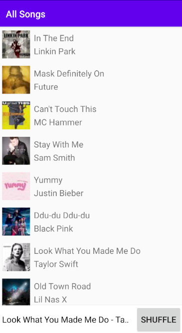
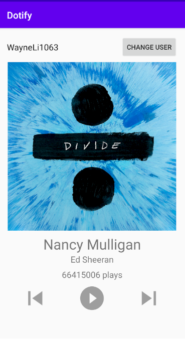

# Dotify
This is a basic Android App written in Kotlin for UW course INFO 448.
Author: Wayne Li

## Homework 2 - Activities & RecyclerView

Completed the song list screen with a miniplayer. Clicking the shuffle button will shuffle the list of songs.  
Single clicking the song item will "play" it and display it on miniplayer.
Clicking the miniplayer text area will display the song info in the music player screen, using the layouts defined in hw1.

Here is the preview of the hw2:

Additionally, I implemented the following extra credit features:
1. A stock Android back arrow for music player screen that allows going back to song list screen for devices that don't have back button.
2. Long pressing a song deletes the song, and a toast will show up to notify user of its deletion.
3. Shuffling is animated for better feedback.

## Homework 1 - Layouts & Events

Completed the UI for music player screen as specified, for the base version, I used ConstraintLayout.

Here is the preview of the hw1:

Additionally, I implemented the following extra credit features:

1. Prohibit username change if edit text field is empty
2. Long pressing img cover changes text color
3. Utilizes a barrier and a guideline in ConstraintLayout
4. All hardcoded strings, dimensions and colors are extracted to xml
5. Album cover image is 1:1 with width matches the screen width
6. Implements the app using another type of layout (Linear Layout)